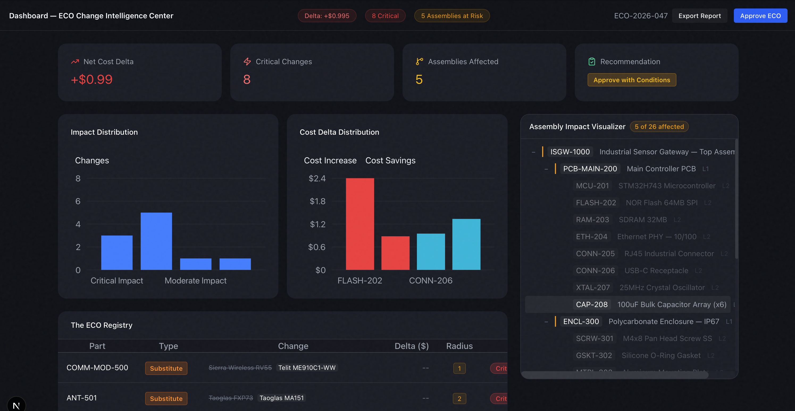
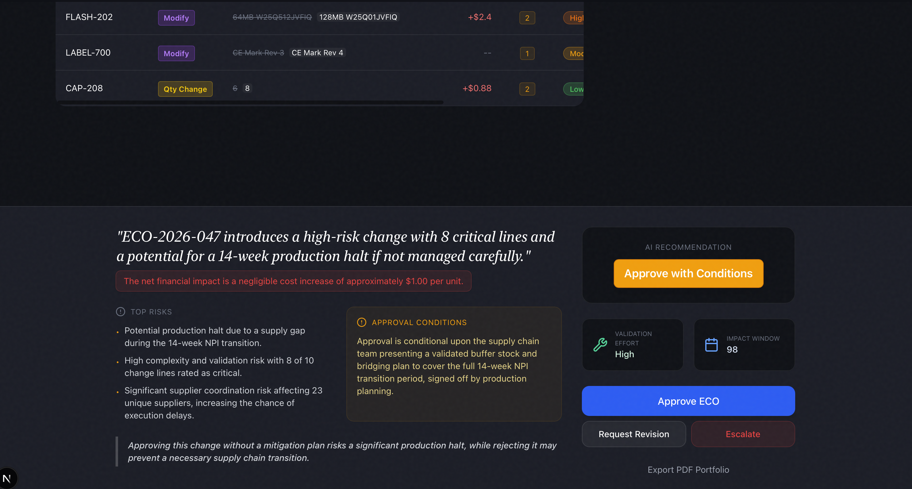

# ECO Impact Tracker Demo

A sophisticated supply chain intelligence dashboard built to analyze the financial and assembly impact of Engineering Change Orders (ECOs) against a Current State Bill of Materials (BOM).

## Screenshots



## Features

- **Dual-CSV Ingestion**: Drop both your Current BOM and the proposed ECO Changes CSV to begin analysis.
- **Blast Radius Calculation**: Computes the upward assembly impact (how many parent assemblies are affected by a component change).
- **Hard Math vs. Generative Analysis**: Uses calculated unit cost overrides combined with `@google/generative-ai` to classify the severity, rationale, and impact score of each change order line.
- **Interactive Matrix & Trees**: Built using `@tremor/react` and recursive React components to help engineers visually understand disruption.
- **Decision Engine**: Generates an automated, shareable ECO portfolio approval recommendation.

## Setup Instructions

1. **Install Dependencies**:
```bash
npm install
```

2. **Set Environment Variables**:
Requires a valid Google Gemini API Key. Create a `.env.local` file in the root of the project:

```env
GEMINI_API_KEY=your_gemini_api_key_here
```

3. **Run the Dashboard**:
```bash
npm run dev
```

The application will be available at `http://localhost:3000`.

## Architecture Notes 
- Built on Next.js 14 App Router.
- Tailwind CSS v4 styling explicitly utilizing a dark "Midnight" theme matching project specifications.
- **Note**: This demo mocks the `ecoAgent` integration for `@antigravity/sdk` as it is an internal package. Replace the mock in `src/lib/antigravity.ts` in production scenarios.
